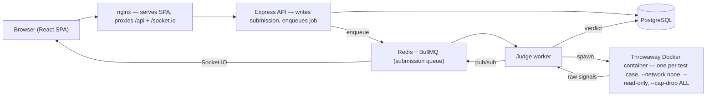

<div align="center">


# NextHire

**A DSA interview-prep platform where every verdict comes from your code actually running against hidden tests — not a simulation.**

Browse and solve problems in a real in-browser editor, submit to a sandboxed multi-language judge, and build up progress, contests and spaced-repetition revision on top.


</div>

---

## Table of Contents

- [Overview](#overview)
- [Screenshots](#screenshots)
- [Live Demo](#live-demo)
- [Features](#features)
- [Tech Stack](#tech-stack)
- [Architecture](#architecture)
- [Project Structure](#project-structure)
- [Prerequisites](#prerequisites)
- [Getting Started](#getting-started)
- [Environment Variables](#environment-variables)
- [Running Locally](#running-locally)
- [Testing](#testing)
- [Production & Deployment](#production--deployment)
- [API](#api)
- [Documentation](#documentation)
- [Engineering Highlights](#engineering-highlights)
- [Known Limitations](#known-limitations)
- [Contributing](#contributing)
- [License](#license)
- [Author](#author)

---

## Overview

Most practice sites either show you a problem with no way to run code, or "check" your solution
with a mock that always passes. **NextHire runs the code.** A submission is executed against every
test case — including hidden ones — inside a locked-down container, and the verdict is derived from
what the process actually did: it can be `ACCEPTED`, `WRONG ANSWER`, `TIME LIMIT EXCEEDED`,
`MEMORY LIMIT EXCEEDED`, `OUTPUT LIMIT EXCEEDED`, `COMPILATION ERROR` or `RUNTIME ERROR`.

Around that judge sits a full product: authenticated accounts, a searchable question library,
per-question progress and streaks, SM-2 spaced-repetition revision, admin-authored questions, and
timed contests with a leaderboard.

It is deliberately personal-scale: one PostgreSQL, one API, one judge worker, one static frontend.

**Languages the judge executes:** Python, C++, Java.

---

## Screenshots

<!-- TODO: Add project screenshots here (e.g. the problem-solving editor, dashboard, contest arena). No screenshots are committed to the repository yet. -->

> No application screenshots are committed to the repository yet. The only images present are brand
> assets (`client/public/logo.svg`, `logo-wordmark.svg`). Capture and add screenshots of the solve
> page, dashboard and contest view here to complete this section.

---

## Live Demo

There is **no hosted/public demo**. NextHire is run locally or self-hosted; the judge requires a
Docker daemon on the host, which a typical static-hosting platform does not provide.

Run it yourself with Docker Compose (the app is served at <http://localhost:8080>) or the local dev
workflow below — see [Getting Started](#getting-started).

---

## Features

**Solve & judge**
- In-browser [Monaco](https://microsoft.github.io/monaco-editor/) editor with per-language starter templates (Python, C++, Java).
- **Run** executes the sample cases only — a scratchpad that never touches history or progress.
- **Submit** executes every case, including hidden ones, and records the attempt.
- Verdicts come from real process execution inside a throwaway, network-isolated Docker container — never a simulation.
- Live verdict push over Socket.IO, with automatic polling fallback if the socket cannot connect.

**Accounts & security**
- Email/password sign-up with mandatory email verification, plus Google and GitHub OAuth (authorization-code flow).
- Short-lived in-memory access token + rotating, reuse-detecting HttpOnly refresh cookie; CSRF-protected refresh.
- Brute-force lockout, "log out everywhere", per-device session listing and revocation, and a per-account security-event timeline.
- Permission-based authorization (a role→permission matrix), with an ADMIN role derived from an email allowlist.

**Library & study**
- Searchable question library filtered by difficulty, topic, company, or whether the problem is solvable here.
- Curated study sheets (system-provided and user-created), private per-question notes, and bookmarks.
- Practice modes: random, daily, by topic, by company, mixed-difficulty, weak-topics and timed mock sets.

**Progress & revision**
- Per-question status, solve stats, a ~26-week submission heatmap, and current/longest streaks.
- SM-2 spaced-repetition scheduler that auto-enqueues on first solve and grades reviews 0–5.

**Contests (admin-hosted)**
- Timed contests with invite codes, participant heartbeats, a live arena, and a leaderboard.

**Admin**
- Author questions (statement, starter code, test cases, hints, editorial, company tags).
- Manage users: search, enable/disable, force password reset, unlock, revoke sessions, view analytics.

---

## Tech Stack

### Frontend
| Technology | Role |
|---|---|
| **React 18 + TypeScript 5** | SPA UI, fully typed. |
| **Vite 5** | Dev server (port 3000, proxies `/api` + `/socket.io`) and production build. |
| **Tailwind CSS v4** | Styling via `@theme` design tokens (dark-only), on top of ~16 in-house UI primitives. |
| **TanStack Query v5** | Server-state fetching/caching. |
| **Zustand** | Lightweight client state. |
| **React Hook Form + Zod** | Forms and client-side validation. |
| **Monaco Editor** | The code editor (lazily loaded as its own chunk). |
| **socket.io-client** | Live submission-verdict push. |
| **axios** | HTTP client with token-refresh and CSRF handling. |

### Backend
| Technology | Role |
|---|---|
| **Node.js 20 + Express 4** | HTTP API (`/api/v1`). Never executes user code. |
| **Prisma 5** | ORM + migrations over PostgreSQL (27 models). |
| **jsonwebtoken** | Signed access tokens. |
| **bcryptjs** | Password hashing. |
| **nodemailer** | Verification / password-reset / notification email. |
| **zod** | Request validation. |
| **BullMQ + ioredis** | Submission job queue on Redis. |
| **Socket.IO** | Verdict fan-out to the submitting browser. |

### Data, judge & infra
| Technology | Role |
|---|---|
| **PostgreSQL 15** | All persistent data. |
| **Redis 7** | BullMQ queue + pub/sub for verdicts. |
| **Docker** | Per-submission sandbox containers: `python:3.10-slim`, `gcc:13`, `eclipse-temurin:17-jdk`. |
| **Docker Compose + nginx** | Full-stack orchestration; nginx serves the SPA and reverse-proxies the API. |

### Testing & tooling
| Technology | Role |
|---|---|
| **Node test runner** (`node:test`) | Server unit tests, no external services required. |
| **e2e smoke script** | Drives the real HTTP API end to end. |
| **oxlint** | Linting (`.oxlintrc.json`). |
| **tsc** | Type-checking the client. |

---

## Architecture

The API **never executes user code**. It writes a submission row and enqueues a job; only the judge
worker executes anything, and it does so inside a container that is `--network none`, `--read-only`,
`--cap-drop ALL`, non-root (`--user 1000:1000`), memory-capped, pid-capped and wall-clock-killed.



Socket.IO carries exactly one thing: *"your submission's verdict is ready."* If it cannot connect,
the client falls back to polling `GET /submissions/:id/result` and everything still works, just less
immediately.

---

## Project Structure

```text
nexthire/
├── client/                       # React + Vite SPA
│   └── src/
│       ├── api/                  # HTTP client (token refresh, CSRF), judge socket, in-memory token store
│       ├── features/             # auth, question-bank, library, contest, revision — each owns its API + components
│       ├── pages/                # one file per route (22 pages)
│       └── shared/               # design-system primitives, hooks, helpers
├── server/                       # Express API + judge worker
│   ├── prisma/                   # schema, migrations, seed data (data/solvable.js, problems.js, sheets.js)
│   ├── scripts/                  # seed, verify-problems, e2e smoke
│   ├── docker/                   # purpose-built judge images (python/cpp/java)
│   └── src/
│       ├── features/
│       │   ├── auth/             # registration, sessions, OAuth, email, admin user management
│       │   ├── question-bank/    # browse, author, submit
│       │   ├── submission/       # read paths + DTO that strips hidden test cases
│       │   ├── contest/          # contests, invites, participation, leaderboard
│       │   ├── library/          # study sheets, progress, notes, practice modes
│       │   ├── revision/         # SM-2 spaced repetition
│       │   └── judge/            # queue, worker, processor, executors, verdict logic
│       └── shared/               # prisma client, permission matrix (authz), rate limiting
├── docs/                         # project documentation (PRD, system design, API, database, testing, roadmap, ADRs)
├── docker-compose.yml            # PostgreSQL + Redis + API + judge worker + nginx frontend
└── .env.example                  # full configuration reference
```

---

## Documentation

Detailed, repository-specific documentation lives in [`docs/`](docs/). This README is the entry
point; the documents below go deep on each area and are kept in sync with the source.

| Document | What's inside |
|---|---|
| [PRD](docs/PRD.md) | Product requirements: goals, personas, user stories, functional/non-functional requirements (tagged Implemented/Planned/Proposed). |
| [System Design](docs/SYSTEM_DESIGN.md) | Architecture, the judge, auth/session security, data flows, deployment, and tradeoffs. |
| [API Reference](docs/API.md) | Endpoints, auth model, permissions, conventions, and request/response examples. |
| [Database](docs/DATABASE.md) | Schema (27 models), ER diagram, enums, relationships, indexes, and migrations. |
| [Testing](docs/TESTING.md) | Test stack, inventory (219 tests), how to run, coverage, and gaps. |
| [Roadmap](docs/ROADMAP.md) | Completed / in progress / planned / proposed — evidence-based. |
| [Architecture Decisions](docs/decisions/) | ADRs for the judge, auth, authorization, architecture, data layer, and run/submit design. |

---

## Prerequisites

**Recommended — Docker (matches production and provides the judge sandbox):**
- [Docker](https://docs.docker.com/get-docker/) + Docker Compose
- Judge sandbox images pulled onto the host (see below)

**Alternative — fully local (no Docker):**
- Node.js **20** and npm
- PostgreSQL **15** and Redis **7** running locally
- `python3`, `g++` and a JDK **17** on `PATH` (for the languages you want the judge to run)

---

## Getting Started

### Option A — Everything in Docker (closest to production)

```bash
# 1. Pull the judge sandbox images the worker will spawn
docker pull python:3.10-slim && docker pull gcc:13 && docker pull eclipse-temurin:17-jdk

# 2. Configure — copy the example env and fill in JWT_SECRET, ADMIN_EMAILS, MAIL_PROVIDER
cp .env.example .env

# 3. Bring up PostgreSQL, Redis, the API, the judge worker and the nginx frontend
docker compose up -d --build
```

The app is served at <http://localhost:8080>. Seed the question library:

```bash
docker compose exec api npm run seed
```

### Option B — Locally, without Docker

Requires PostgreSQL and Redis running, plus `python3`, `g++` and a JDK on `PATH`.

```bash
# --- API + judge worker ---
cd server && npm install
cp ../.env.example .env               # edit DATABASE_URL, JWT_SECRET, ADMIN_EMAILS
npm run prisma:generate
npm run prisma:migrate                # or: npm run prisma:push for a throwaway database
npm run seed
npm start                             # terminal 1 — API on :5000
npm run worker                        # terminal 2 — judge worker

# --- frontend ---
cd ../client && npm install && npm run dev   # terminal 3 — app on :3000
```

Set `MAIL_PROVIDER=console` in development: verification and password-reset links are printed to the
server's stdout instead of being emailed.

### Option C — No Docker at all (unsafe local judge)

For machines without Docker, the judge can run submissions directly on the host with no sandbox:

```bash
JUDGE_INLINE=1 JUDGE_UNSAFE_LOCAL=1 npm start
```

This runs untrusted code as your user with only a timeout — a development convenience, nothing more.
The server **refuses to boot in production** with either flag set (see `assertProductionConfig()` in
[`server/src/features/auth/authConfig.js`](server/src/features/auth/authConfig.js)).

---

## Environment Variables

The complete, commented list is in [`.env.example`](.env.example). For Docker, place `.env` next to
`docker-compose.yml`; for the local workflow, place it in `server/`. The variables without a safe
default:

| Variable | Description | Required |
|---|---|---|
| `DATABASE_URL` | PostgreSQL connection string. | Yes |
| `JWT_SECRET` | 48 random bytes: `node -e "console.log(require('crypto').randomBytes(48).toString('base64url'))"` | Yes |
| `ADMIN_EMAILS` | Comma-separated. These addresses get ADMIN on sign-in; everyone else is USER. | Yes |
| `MAIL_PROVIDER` | `console` in development; `smtp` / `resend` / `sendgrid` in production (which refuses `console`). | Yes |
| `CLIENT_URL` | Origin users visit — used for email links and CORS. | Yes |
| `REDIS_URL` | Only when running the queue (the default). | When using the queue |
| `GOOGLE_CLIENT_ID` / `GOOGLE_CLIENT_SECRET` | Enable Google sign-in (button renders "not configured" when absent). | Optional |
| `GITHUB_CLIENT_ID` / `GITHUB_CLIENT_SECRET` | Enable GitHub sign-in (both required together). | Optional |
| `EMAIL_VERIFICATION_REQUIRED` | `false` to allow sign-in without verifying email. | Optional |

Token lifetimes, password policy, brute-force thresholds, judge concurrency and sandbox image names
all have sensible defaults in `.env.example`. In production the server validates its own
configuration at boot and crashes rather than start with a dev secret, insecure cookies, a mail
provider that silently drops verification emails, or either judge escape hatch enabled.

---

## Running Locally

| Service | URL / Port | Started by |
|---|---|---|
| Frontend (Vite dev) | <http://localhost:3000> | `cd client && npm run dev` |
| API (Express) | <http://localhost:5000> | `cd server && npm start` |
| Judge worker | — (consumes the queue) | `cd server && npm run worker` |
| Full stack (nginx) | <http://localhost:8080> | `docker compose up` |

The Vite dev server proxies `/api` and `/socket.io` to the API on `:5000`, so the browser sees a
single origin (which keeps the refresh cookie same-site).

---

## Testing

```bash
cd server && npm test                 # unit tests (219), no external services needed
cd server && npm run verify:problems  # every solvable problem's reference solution vs its own tests
cd server && npm run test:e2e         # end-to-end smoke test — needs a running server
cd client && npm run typecheck && npm run build
```

The unit tests use Node's built-in test runner (`node:test`) and cover the pure verdict logic,
authorization, session rotation, DTOs and more. The e2e smoke test drives the real HTTP API —
registration through email verification, all verdicts from real execution, contest scoring and
expiry, IDOR probes and malformed input; see the header of
[`server/scripts/e2eSmoke.mjs`](server/scripts/e2eSmoke.mjs).

---

## Production & Deployment

`docker-compose.yml` is the deployment unit: it builds and runs PostgreSQL, Redis, the API, the judge
worker and the nginx-served frontend, each with health checks. Notes:

- **Committed Prisma migration** (`server/prisma/migrations`) — the API image runs `prisma migrate deploy`.
- **Judge worker needs the host Docker socket** (`/var/run/docker.sock`), which is root-equivalent. Run it on a host dedicated to judging; scale with `docker compose up --scale judge-worker=N`.
- **Java sandbox:** stock images have no uid 1000; if Java submissions come back `INTERNAL_ERROR`, build the purpose-made image (`server/docker/Dockerfile.java`) and point `JUDGE_IMAGE_JAVA` at it.
- **Production config is enforced at boot** — real `MAIL_PROVIDER`, secure cookies, a strong `JWT_SECRET`, and no judge escape hatches, or the server exits.

There is no hosted instance; see [Live Demo](#live-demo).

---

## API

Base URL `http://localhost:5000/api/v1` (every router is also mounted, unversioned, at `/api/*`).
Responses use a uniform envelope: `{ success, data }` or `{ success, error, code }`. Authenticated
requests send `Authorization: Bearer <access token>`; `/auth/refresh` and `/auth/logout`
authenticate via the HttpOnly refresh cookie and a CSRF token instead.

The tables below list the most important endpoints; the full surface lives in the six
`server/src/features/*/`*Routes.js* files, and an OpenAPI stub is served at `/docs` in development.

**Auth — `/auth`**

| Method | Endpoint | Auth | Description |
|---|---|---|---|
| POST | `/register` | Public | Create account, email a verification link (does not sign in). |
| POST | `/login` | Public | Password login; sets refresh + CSRF cookies. |
| POST | `/google` · GET `/github/start` | Public | Google (ID token) / GitHub (code flow) sign-in. |
| POST | `/refresh` | Cookie + CSRF | Rotate refresh cookie, issue a new access token. |
| GET | `/me` | Authenticated | Current account + resolved permission list. |
| GET/DELETE | `/sessions` · `/sessions/:id` | Authenticated | List / revoke signed-in devices. |
| GET/PATCH | `/admin/users` · `/admin/users/:id/status` | ADMIN | Search users; enable/disable, unlock, reset, revoke. |

**Questions & submissions**

| Method | Endpoint | Auth | Description |
|---|---|---|---|
| GET | `/questions` | Public (optional auth) | Paginated/filtered browse; merges progress badges when signed in. |
| GET | `/questions/:id` | Authenticated | Detail; hidden test cases returned to ADMIN only. |
| POST | `/questions/:id/execute` | Verified user | Submit practice code (mode `run` or `submit`). |
| POST | `/questions` | ADMIN | Author a question with tests, starter code, editorial. |
| GET | `/submissions/:id/result` | Authenticated | Latest execution result (`{ pending: true }` until judged). |
| POST | `/submissions/:id/rejudge` | ADMIN | Reset to `PENDING` and re-enqueue. |

**Contests, library & revision**

| Method | Endpoint | Auth | Description |
|---|---|---|---|
| POST | `/contests` | ADMIN | Create a contest (generates an invite code). |
| POST | `/contests/join-by-code` | Verified user | Join via invite code (enforces expiry / usage cap). |
| POST | `/contests/:id/submit` | Verified participant | Submit within the live contest window. |
| GET | `/contests/:id/leaderboard` | Public (optional auth) | Ranked participants (name + avatar only). |
| GET | `/library/progress/activity` | Signed-in user | Submission heatmap + current/longest streaks. |
| GET | `/library/practice/daily` | Public (optional auth) | Deterministic daily question. |
| POST | `/revision/review` | Signed-in user | Grade a review `{ questionId, quality 0–5 }` and reschedule. |

---

## Engineering Highlights

The decisions worth calling out — each is a deliberate trade, not an accident.

**The access token lives in a JavaScript variable, not `localStorage`.** Anything in `localStorage`
is readable by any script on the page, so one XSS bug leaks a credential an attacker can walk away
with. The token dies with the tab; the refresh token sits in an HttpOnly cookie the page cannot read,
and the app calls `/auth/refresh` once on boot to restore the session.

**Refresh tokens rotate and detect reuse.** Each session stores the SHA-256 of its current refresh
token and of the one it replaced. Presenting the old one means the token was stolen and replayed, so
every session for that user is revoked.

**Every authenticated request re-checks the database.** A valid signature is not enough: the account
must still exist, still be enabled, still match its `tokenVersion`, and its session must not be
revoked. That one indexed lookup per request is what makes "log out everywhere" and "disable this
account" take effect immediately instead of after the token expires.

**ADMIN comes from `ADMIN_EMAILS`, not the database.** The role is re-derived on every sign-in, so
promoting or demoting someone is a config change. There is deliberately no role-editing endpoint —
anything it wrote would be undone at the next login.

**Routes declare permissions, not roles.** `requirePermission('question:manage')` rather than
`requireAdmin`. The matrix in [`server/src/shared/authz.js`](server/src/shared/authz.js) is the only
place mapping roles to capabilities, and `/auth/me` hands the client the same list so the UI never
recomputes it.

**Run and Submit are different operations.** Run executes sample cases only, flagged as a trial run,
and never touches history, progress, streaks or a leaderboard. If both buttons hit the hidden tests,
the count of hidden failures alone would tell a solver something they should not know.

**Hidden test cases never leave the server.** Every submission read path goes through a DTO that
drops non-sample test results entirely. Non-admins get the aggregate pass/total and nothing else, and
submission reads are ownership-checked (no IDOR).

**Verdict logic is a pure function.**
[`judge/executor/verdict.js`](server/src/features/judge/executor/verdict.js) takes the raw signals
from a container run — timed out, OOM-killed, output truncated, exit code, stdout — and returns a
verdict, with no I/O, so it is exhaustively unit-tested. Resource-limit signals are checked before
correctness, because a killed program has no trustworthy output.

**The seed refuses to write a problem it cannot verify.** Every solvable problem ships a reference
solution; `npm run seed` runs it against all of that problem's test cases first and aborts on any
mismatch. A wrong expected output is the worst bug a judge can have — the user writes a correct
solution, gets `WRONG ANSWER`, and cannot tell that from their own bug.

**The library is mostly links, and says so.** 148 entries are metadata plus a source URL (title,
topic, difficulty, company tags) — no statements or test cases copied from anywhere — which gives the
library and the 5 study sheets breadth. The 12 problems in
[`server/prisma/data/solvable.js`](server/prisma/data/solvable.js) are written for NextHire and are
what the judge actually runs; the browse filter defaults to those.

---

## Known Limitations

- **12 solvable problems.** Enough to exercise every feature end to end; not enough for months of prep. Adding more means adding entries to `server/prisma/data/solvable.js`.
- **In-memory rate limiting.** Each API replica enforces its own window — correct for a single instance; put a gateway limiter in front if you scale out.
- **The judge worker needs the host Docker socket**, which is root-equivalent on that host. Run it somewhere dedicated to judging.
- **Monaco is a large chunk** (~1&nbsp;MB gzipped). It is split out and lazily loaded, so it doesn't block the problem statement and is cached across deploys.
- **Contests are admin-created.** A normal user joins with a code but cannot host one.

---

## Contributing

Contributions are welcome. There is no formal `CONTRIBUTING.md`; the practical workflow is:

1. Fork and branch from `main`.
2. Make your change, matching the existing feature-sliced structure and code style.
3. Before opening a PR, make sure the checks pass:
   ```bash
   cd server && npm test && npm run verify:problems
   cd client && npm run typecheck && npm run build
   ```
4. Open a pull request describing the change and the trade-offs behind it.

---

## License

No `LICENSE` file is currently present in the repository, so the project is **"all rights reserved"
by default** — there is no granted permission to use, modify or distribute it.

<!-- TODO: Add a LICENSE file (e.g. MIT) if open-source use is intended. -->

---

## Author

**Manish Tiwari** — [@manishtiwari2](https://github.com/manishtiwari2)

Repository: <https://github.com/manishtiwari2/nexthire>
