# Database Design

> Source of truth: [`server/prisma/schema.prisma`](../server/prisma/schema.prisma).
> This document describes what is **implemented** in that schema. Where it notes something
> planned or unused, it says so explicitly.

## Overview

NextHire uses **PostgreSQL 15** accessed through **Prisma 5** (`prisma-client-js`). The schema
defines **27 models** and **14 enums**, applied to the database as a single baseline migration
(`0_init`). The design is relational and largely normalised to 3NF: reference data (topics, tags,
companies) is factored into its own tables, many-to-many links go through explicit join models,
and per-user state (progress, notes, revision schedule) is separated from the shared question
bank.

Two deliberate departures from strict normalisation exist for good reasons:

- **`ExecutionResult.testResults`** is a `Json?` column holding the per-test breakdown of a judged
  submission. It is write-once, read-as-a-unit, and never queried by its internal fields, so a
  document column is a better fit than a `TestCaseResult` table with one row per test.
- **`Question.subtopics`** is a `String[]` (Postgres array) rather than a child table, because
  subtopics are free-form labels attached to a question and are only ever read as a set.

## Entity–relationship diagram

```mermaid
erDiagram
    User ||--o{ Session : "has"
    User ||--o{ AuthToken : "has"
    User ||--o{ AuthEvent : "logs"
    User ||--o| Profile : "has"
    Profile ||--o{ ProfileSkill : "lists"
    User ||--o{ Submission : "makes"
    User ||--o{ ContestParticipant : "enters"
    User ||--o{ RevisionSchedule : "schedules"
    User ||--o{ Contest : "hosts"
    User ||--o{ ContestInvite : "creates"
    User ||--o{ StudySheet : "owns"
    User ||--o{ UserQuestionProgress : "tracks"
    User ||--o{ UserQuestionNote : "writes"

    Topic ||--o{ Question : "categorises"
    Question ||--o{ StarterCode : "provides"
    Question ||--o{ TestCase : "verified by"
    Question ||--o{ Hint : "hints"
    Question ||--o| Editorial : "explained by"
    Question ||--o{ QuestionTagMap : ""
    Tag ||--o{ QuestionTagMap : ""
    Question ||--o{ CompanyTagMap : ""
    CompanyTag ||--o{ CompanyTagMap : ""
    Question ||--o{ ContestQuestion : ""
    Contest ||--o{ ContestQuestion : ""
    Question ||--o{ SheetItem : ""
    StudySheet ||--o{ SheetItem : ""
    Question ||--o{ Submission : "attempted in"
    Question ||--o{ RevisionSchedule : "reviewed in"
    Question ||--o{ UserQuestionProgress : "progressed in"
    Question ||--o{ UserQuestionNote : "annotated in"

    Contest ||--o{ ContestParticipant : "has"
    Contest ||--o{ ContestInvite : "invites via"
    Contest ||--o{ Submission : "receives"

    Submission ||--o{ ExecutionResult : "judged into"
```

## Enums

| Enum | Values | Notes |
|---|---|---|
| `Role` | `ADMIN`, `USER`, `CANDIDATE` | `CANDIDATE` is deprecated — a legacy alias for `USER`. `scripts/migrateAuth.js` rewrites old rows; app code normalises it to `USER`. |
| `AuthProvider` | `PASSWORD`, `GOOGLE`, `GITHUB` | Which credential established a login/session. |
| `AuthTokenType` | `EMAIL_VERIFICATION`, `PASSWORD_RESET` | Single-use hashed email tokens. |
| `AuthEventType` | `REGISTER`, `LOGIN_SUCCESS`, `LOGIN_FAILED`, `LOGOUT`, `LOGOUT_ALL`, `TOKEN_REFRESH`, `TOKEN_REUSE_DETECTED`, `PASSWORD_RESET_REQUESTED`, `PASSWORD_RESET`, `PASSWORD_CHANGED`, `EMAIL_VERIFIED`, `ACCOUNT_LOCKED`, `ACCOUNT_DISABLED`, `ACCOUNT_ENABLED`, `ROLE_CHANGED`, `GOOGLE_LINKED`, `GOOGLE_UNLINKED`, `GITHUB_LINKED`, `GITHUB_UNLINKED` | Security-timeline audit trail. |
| `Difficulty` | `EASY`, `MEDIUM`, `HARD` | |
| `Language` | `PYTHON`, `JAVASCRIPT`, `TYPESCRIPT`, `CPP`, `JAVA`, `GO` | The enum lists six, but only **`PYTHON`, `CPP`, `JAVA`** are executable by the judge today (see [SYSTEM_DESIGN.md](SYSTEM_DESIGN.md)). The others are reserved. |
| `ContestStatus` | `UPCOMING`, `LIVE`, `ENDED` | Advanced by a periodic sweep and lazily on read. |
| `SourcePlatform` | `LEETCODE`, `GEEKSFORGEEKS`, `HACKERRANK`, `CODEFORCES`, `CODECHEF`, `ATCODER`, `INTERVIEWBIT`, `CUSTOM` | Origin of a referenced problem. The browse API also accepts arbitrary source strings, so data can lead the schema. |
| `FrequencyBand` | `LOW`, `MEDIUM`, `HIGH`, `VERY_HIGH` | Coarse interview-frequency band; `frequencyScore` holds a finer 0–100 value. |
| `ContentStatus` | `DRAFT`, `IN_REVIEW`, `PUBLISHED`, `ARCHIVED` | Authoring/curation lifecycle of a question. |
| `ProgressStatus` | `TODO`, `ATTEMPTED`, `SOLVED` | A user's personal solve state. |
| `SheetKind` | `SYSTEM`, `CUSTOM` | Curated vs. user-authored study sheets. |
| `SubmissionStatus` | `PENDING`, `RUNNING`, `ACCEPTED`, `WRONG_ANSWER`, `TIME_LIMIT_EXCEEDED`, `MEMORY_LIMIT_EXCEEDED`, `OUTPUT_LIMIT_EXCEEDED`, `COMPILATION_ERROR`, `RUNTIME_ERROR`, `INTERNAL_ERROR`, `CANCELLED` | Lifecycle + terminal verdicts of a submission. |
| `SubmissionContext` | `PRACTICE`, `CONTEST` | Set server-side; clients cannot forge `CONTEST`. |

## Entities

### Users & authentication

#### `User`
The central identity. Supports password and OAuth credentials on the same account.

| Field | Type | Notes |
|---|---|---|
| `id` | `String` PK | UUID. |
| `email` | `String` **unique** | Primary login identifier. |
| `name` | `String` | |
| `role` | `Role` = `USER` | Effective admin is re-derived from `ADMIN_EMAILS` on each sign-in, not trusted from this column alone. |
| `avatarUrl` | `String?` | Serialised as `avatar` in the DTO. |
| `googleId` | `String?` **unique** | Set when a Google account is linked. |
| `githubId` | `String?` **unique** | GitHub's numeric account id (as string), not the login name. |
| `isVerified` | `Boolean` = `true` | Legacy flag kept for pre-rewrite rows; `emailVerified` is what the auth system enforces. |
| `passwordHash` | `String?` | bcrypt (12 rounds). Null for OAuth-only accounts. Never serialised. |
| `passwordChangedAt` | `DateTime?` | |
| `mobile` | `String?` **unique** | E.164; null until profile completion for OAuth accounts. |
| `emailVerified` / `emailVerifiedAt` | `Boolean` / `DateTime?` | The enforced verification state. |
| `mobileVerified` | `Boolean` = `false` | |
| `isActive` / `disabledReason` | `Boolean` / `String?` | Disabled accounts are ejected on the next request. |
| `tokenVersion` | `Int` = `0` | Bumped on logout-all, password change/reset, disable, role change. Access tokens carry the version they were minted with and are rejected once stale. |
| `failedLoginAttempts` / `lockedUntil` | `Int` / `DateTime?` | Per-account lockout. |
| `lastLogin` / `lastActive` | `DateTime?` | |
| `createdAt` / `updatedAt` | `DateTime` | |

#### `Session`
One row per signed-in device. Stores only the **hash** of the refresh token.

| Field | Type | Notes |
|---|---|---|
| `id` | `String` PK | UUID; also the `sid` claim in access tokens. |
| `userId` | `String` FK → User | `onDelete: Cascade`. |
| `tokenHash` | `String` **unique** | sha256 of the current refresh token. |
| `previousTokenHash` | `String?` **unique** | sha256 of the token this one replaced — enables one-step reuse detection. |
| `provider` | `AuthProvider` = `PASSWORD` | |
| `rememberMe` | `Boolean` = `false` | Controls refresh TTL and cookie persistence. |
| `userAgent`, `browser`, `os`, `device`, `ipAddress` | `String?` | Parsed device metadata for the sessions list. |
| `expiresAt`, `lastUsedAt`, `revokedAt`, `revokedReason`, `createdAt` | `DateTime(?)` | Expiry is always enforced at read time. |

Indexes: `@@index([userId])`, `@@index([expiresAt])`.

#### `AuthToken`
Single-use, hashed email tokens (verification, password reset). Only the sha256 hash is stored; the raw token exists solely in the emailed link.

Key fields: `type` (`AuthTokenType`), `tokenHash` (**unique**), `expiresAt`, `usedAt?`. Indexes: `@@index([userId, type])`, `@@index([expiresAt])`.

#### `AuthEvent`
Append-only security timeline. `userId` is **nullable** so failed logins against unknown emails are still recorded (and rate-limit auditable) without leaking whether an account exists. Records `email`, `type`, `provider?`, `detail?`, `ipAddress?`, `userAgent?`. Indexes: `@@index([userId, createdAt])`, `@@index([email, createdAt])`, `@@index([type, createdAt])`.

#### `Profile` / `ProfileSkill`
Optional 1:1 extension of a user (`bio`, `githubUrl`, `linkedinUrl`) with a child list of free-form `skillName` rows.

### Question bank & taxonomy

#### `Topic`
Canonical categories. `name` and `slug` both **unique**. One topic has many questions.

#### `Question`
The core content entity. Holds both **local solvable** problems (full statement + tests) and **reference-only** entries (`isExternalOnly = true`: metadata + `sourceUrl`, no statement/tests — the solve page links out instead of running the judge).

| Field | Type | Notes |
|---|---|---|
| `id` | `String` PK | UUID. |
| `title` | `String` | |
| `slug` | `String` **unique** | |
| `difficulty` | `Difficulty` = `EASY` | |
| `topicId` | `String` FK → Topic | |
| `description`, `constraints` | `String` | Empty for reference-only entries. |
| `timeLimitMs` / `memoryLimitMb` | `Int` = `2000` / `256` | Judge limits. |
| `subtopics` | `String[]` = `[]` | |
| `frequencyBand` / `frequencyScore` | `FrequencyBand?` / `Int?` | Interview-frequency signals. |
| `estimatedTimeMin` | `Int?` | |
| `sourcePlatform` | `SourcePlatform` = `CUSTOM` | |
| `sourceUrl`, `originalAuthor`, `authorNotes` | `String?` | `authorNotes` ≠ the private per-user notes. |
| `contentStatus` | `ContentStatus` = `PUBLISHED` | |
| `acceptanceRate` | `Float?` | Internal, 0–100 if tracked. |
| `isExternalOnly` | `Boolean` = `false` | Distinguishes reference-only from solvable. |
| `createdAt` / `updatedAt` | `DateTime` | |

Indexes: `@@index([topicId])`, `@@index([sourcePlatform])`, `@@index([frequencyBand])`.

#### Question children
- **`StarterCode`** — per-language editor template; `@@unique([questionId, language])`.
- **`TestCase`** — `input`, `expectedOutput`, `explanation?`, `isSample` (sample vs. hidden), `orderIndex`. Hidden-case I/O is never sent to non-admin clients.
- **`Hint`** — ordered `content`.
- **`Editorial`** — 1:1 with a question (`questionId` **unique**); `content` + `solution`.

#### Tagging (many-to-many)
- **`Tag`** ⇄ **`Question`** via **`QuestionTagMap`** (composite PK `[questionId, tagId]`).
- **`CompanyTag`** ⇄ **`Question`** via **`CompanyTagMap`** (composite PK `[questionId, companyTagId]`).

### Study sheets

- **`StudySheet`** — `name`, `slug` (**unique**), `kind` (`SYSTEM`/`CUSTOM`), `ownerId?` (null for system sheets), `isPublic`. Indexes on `ownerId` and `kind`.
- **`SheetItem`** — join between a sheet and a question with an optional `section` label and `orderIndex`; `@@unique([sheetId, questionId])`, `@@index([sheetId])`.

### Per-user state

- **`UserQuestionProgress`** — one row per (user, question): `status`, `attempts`, `acceptedCount`, `totalSolveSec`, `solveSessions`, `isBookmarked`, `firstSolvedAt?`, `lastPracticedAt?`. `@@unique([userId, questionId])` plus indexes on `userId`, `questionId`, and `[userId, status]`.
- **`UserQuestionNote`** — private prep notes with structured fields (`approach`, `mistakes`, `edgeCases`, `timeComplexity`, `spaceComplexity`, `keyInsights`, `revisionNotes`). `@@unique([userId, questionId])`. Always scoped to the owner by the API.
- **`RevisionSchedule`** — SM-2 spaced-repetition state per (user, question): `intervalDays`, `easeFactor` (default 2.5), `reviewCount`, `lastReviewedAt`, `nextReviewAt`. `@@unique([userId, questionId])`.

### Contests

- **`Contest`** — `title`, `description`, `startTime`, `endTime`, `status`, `hostId` (→ User, relation `ContestHost`).
- **`ContestQuestion`** — join with `orderIndex` and `points` (default 100); `@@unique([contestId, questionId])`.
- **`ContestInvite`** — `code` (**unique**), `creatorId` (relation `InviteCreator`), `maxUses?`, `usedCount`, `expiresAt?`.
- **`ContestParticipant`** — `score`, `penalty`, `rank?`, `isDisqualified`, plus `registeredAt`/`startedAt?`/`finishedAt?`/`lastHeartbeatAt?`; `@@unique([contestId, userId])`.

### Submissions & execution

#### `Submission`
An attempt record — the unit the judge verdict is delivered against.

| Field | Type | Notes |
|---|---|---|
| `id` | `String` PK | UUID; also the BullMQ `jobId` and the Socket.IO correlation id. |
| `userId` / `questionId` | FK | |
| `context` | `SubmissionContext` = `PRACTICE` | Set server-side. |
| `contestId` | `String?` FK → Contest | Only set by the contest submit path. |
| `code` | `String` | |
| `language` | `Language` | |
| `status` | `SubmissionStatus` = `PENDING` | |
| `isTrialRun` | `Boolean` = `false` | A **Run** (samples only) vs. a **Submit** (all tests). Trial runs are excluded from history and never touch progress, streaks, acceptance rate, or contest score — but still need a row to carry the verdict. |
| `createdAt` | `DateTime` | |

Indexes: `@@index([userId])`, `@@index([questionId])`, `@@index([contestId])`, `@@index([userId, isTrialRun])` (history/progress queries always filter trial runs out).

#### `ExecutionResult`
The judged outcome, separated from the submission so the attempt record stays small and the (potentially large) result payload is written once by the worker.

Key fields: `status`, `language?`, `executionTime?`, `memoryUsed?`, `passCount`, `totalTestCases`, `compilerOutput?`, `runtimeOutput?`, `stderr?`, `exitCode?`, `testResults` (`Json?` — per-test breakdown), `judgedAt`. Index: `@@index([submissionId])`.

> **Security note:** `testResults` contains per-test I/O including hidden cases. The API DTO strips hidden-case I/O before it reaches non-admin clients — enforced by tests (`hiddenTestcases.test.js`, `submissionExposure.test.js`).

## Relationships summary

| Relationship | Cardinality | Delete behaviour |
|---|---|---|
| User → Session / AuthToken / AuthEvent | 1 : N | Cascade (AuthEvent keeps null `userId` for unknown-email failures) |
| User → Profile | 1 : 0..1 | Cascade |
| Profile → ProfileSkill | 1 : N | Cascade |
| Topic → Question | 1 : N | Restrict (no cascade; topics are referenced) |
| Question → StarterCode / TestCase / Hint / Editorial | 1 : N (Editorial 1:0..1) | Cascade |
| Question ⇄ Tag, Question ⇄ CompanyTag | M : N via map tables | Cascade on both sides of the map |
| Question ⇄ Contest | M : N via ContestQuestion | Cascade |
| Question ⇄ StudySheet | M : N via SheetItem | Cascade |
| User/Question → UserQuestionProgress / UserQuestionNote / RevisionSchedule | 1 : N (unique per pair) | Cascade |
| Contest → ContestParticipant / ContestInvite / ContestQuestion | 1 : N | Cascade |
| User → Contest (host) / ContestInvite (creator) | 1 : N | Restrict (no cascade specified) |
| User/Question → Submission | 1 : N | Cascade |
| Contest → Submission | 1 : 0..N | Restrict (optional relation) |
| Submission → ExecutionResult | 1 : N | Cascade |

## Data integrity

- **Uniqueness that enforces business rules:** one progress/notes/revision row per (user, question); one starter template per (question, language); one participant per (contest, user); unique `slug` on Question/Topic/StudySheet; unique `code` on ContestInvite; unique `email`/`googleId`/`githubId`/`mobile` on User.
- **Reuse detection** rides on the unique `tokenHash`/`previousTokenHash` columns of `Session`.
- **Cascade deletes** keep dependent rows from being orphaned when a user, question, or contest is removed.
- **Server-authoritative fields:** `context`, `contestId`, `status`, `isTrialRun`, effective `role`, and points/score are all set by the server; the client cannot forge them.

## Migrations

The schema is applied as a single committed baseline migration:

- `server/prisma/migrations/0_init/migration.sql` — 27 `CREATE TABLE` + 14 `CREATE TYPE`.
- `server/prisma/migrations/README.md` documents the workflow.

| Situation | Command |
|---|---|
| First deploy (empty DB) | `npm run prisma:migrate` (`prisma migrate deploy`) |
| DB previously created with `db push` | `npx prisma migrate resolve --applied 0_init` then `npm run prisma:migrate` |
| Schema change from now on | `npx prisma migrate dev --name what_changed`, commit the folder |

The project moved off `prisma db push` (which rewrites the DB with no history) to tracked migrations
precisely so a deployment holding real submissions has a reviewable, roll-forward history.
`prisma migrate deploy` is the only command intended to touch a production database.

> **Operational caveat:** migrations are **not** run automatically by the API container — the
> compose `api` command is `npm start`. Apply migrations out-of-band (`npm run prisma:migrate`)
> before or during a deploy. See [SYSTEM_DESIGN.md](SYSTEM_DESIGN.md#deployment).

## Design tradeoffs

- **Separate `ExecutionResult` from `Submission`** — keeps the hot attempt record small and lets the
  worker write the heavy result payload once. Cost: a join (or second query) to show a verdict.
- **`testResults` as JSON** — right for write-once/read-whole data; the tradeoff is you cannot query
  or index individual test outcomes in SQL.
- **`isTrialRun` on `Submission` rather than a separate table** — Run and Submit share the entire
  judging pipeline and verdict-delivery mechanism, so one table with a flag (and an index that
  filters it out) avoids duplicating that machinery.
- **Effective admin from `ADMIN_EMAILS`, not solely the `role` column** — makes admin access a
  deployment-config decision that is re-evaluated every sign-in, rather than a mutable data value.
  See [ADR-0003](decisions/0003-permission-matrix-and-admin-emails.md).
- **`Language` enum wider than the judge supports** — reserves identifiers for future runtimes
  without a migration; the judge's `languageConfig` is the actual gate on what runs.
