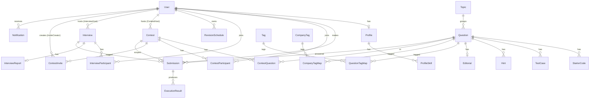

# NextHire — Database Design

> Source of truth: `server/prisma/schema.prisma` (PostgreSQL, Prisma 5). Last reviewed 2026-07-31.

## Entity-Relationship Overview

## Enums

| Enum | Values | Why |
|------|--------|-----|
| `Role` | ADMIN, CANDIDATE | Coarse RBAC; drives `requireAdmin`. |
| `Difficulty` | EASY, MEDIUM, HARD | Question classification + filtering. |
| `Language` | PYTHON, JAVASCRIPT, TYPESCRIPT, CPP, JAVA, GO | Starter code + submission language; judge branch. |
| `ContestStatus` | UPCOMING, LIVE, ENDED | Time-driven lifecycle; UI badges. |
| `InterviewStatus` | SCHEDULED, WAITING_ROOM, IN_PROGRESS, COMPLETED, CANCELLED | Reserved; interviews not implemented. |
| `SubmissionStatus` | PENDING, RUNNING, ACCEPTED, WRONG_ANSWER, TIME_LIMIT_EXCEEDED, MEMORY_LIMIT_EXCEEDED, COMPILATION_ERROR, RUNTIME_ERROR | Judge verdict states; only PENDING/RUNNING/ACCEPTED/COMPILATION_ERROR actually produced. |
| `SubmissionContext` | PRACTICE, CONTEST, INTERVIEW | Distinguishes where a submission came from. |
| `ParticipantRole` | CANDIDATE, INTERVIEWER, OBSERVER | Interview participant role; reserved. |
| `NotificationType` | SYSTEM, CONTEST, INTERVIEW, SUBMISSION, AI_INSIGHT | Reserved; no notification write path. |

## Tables

### User
Identity + role. `email` and `googleId` unique. `isVerified` defaults `true` (no verification
flow). `role` defaults CANDIDATE. **No password/hash column** — auth cannot verify credentials.
Relations fan out to every user-owned entity. Rationale: central identity anchor.

### Profile / ProfileSkill
1:1 with User (`userId` unique, cascade delete). Bio + social links. Skills normalized into
`ProfileSkill` rows (3NF) rather than a CSV column. **Note:** `Profile` in schema lacks the
`rank`/`streak` fields that `shared/types.ts` and the README advertise — a schema/type drift.

### Topic
Question grouping; `name`/`slug` unique. Created on demand by `createQuestion`.

### Question
Core problem entity. `slug` unique. FK `topicId` (**required**, so a question cannot exist
without a topic). `constraints` is required (non-null) — `createQuestion` defaults it. Limits
(`timeLimitMs`=2000, `memoryLimitMb`=256) intended for the judge (unused by the stubbed judge).
Indexed on `topicId` for topic filtering. Cascade children: starter code, test cases, hints,
editorial, tag maps, contest links, submissions, revisions, AI hints.

### StarterCode
Per-language template. `@@unique([questionId, language])` prevents duplicate templates per
language. Cascade on question delete.

### TestCase
Input/expected output; `isSample` flags publicly shown examples; `orderIndex` for ordering;
optional `explanation`. **No index** — fetched by `questionId`. **Design risk:** non-sample
(hidden) cases live in the same table with no field-level protection; the read API does not
distinguish, so hidden cases leak (see Security Report).

### Hint / Editorial
Ordered hints (`orderIndex`) and a 1:1 editorial (`questionId` unique) with prose + solution.
Both cascade. Editorial solution is sensitive (answer key) — currently exposed publicly.

### Tag / QuestionTagMap, CompanyTag / CompanyTagMap
Many-to-many via explicit join tables with composite PKs (`@@id([...])`), cascade on both sides.
3NF-clean. **Write path is not implemented** (no route creates tags), so these are read-only in
practice and usually empty.

### RevisionSchedule
SM-2 spaced repetition state per (user, question) — `@@unique([userId, questionId])`,
`intervalDays`, `easeFactor` (default 2.5), `reviewCount`, `lastReviewedAt`, `nextReviewAt`
(**required, no default** — inserts must compute it). **No route reads/writes this table**; the
SM-2 math exists only in a unit test. Effectively unused at runtime.

### Contest / ContestQuestion / ContestInvite / ContestParticipant
- **Contest**: title/description/banner, `startTime`/`endTime`, `status`, `hostId` (FK to host).
- **ContestQuestion**: ordered link with `points` (default 100). `@@unique([contestId, questionId])`.
- **ContestInvite**: unique `code`, optional `maxUses`/`expiresAt`, `usedCount`. `expiresAt` is
  stored but **never enforced** on join. `creatorId` FK.
- **ContestParticipant**: `@@unique([contestId, userId])`; tracks `startedAt`, `finishedAt`,
  `lastHeartbeatAt`, `score`, `penalty`, `isDisqualified`, `rank`. **`score`/`penalty`/`rank`
  are never written** by any code path → static leaderboard. No index on `contestId` for the
  leaderboard query (relies on the unique composite).

### Interview / InterviewParticipant / InterviewReport
Full mock-interview model (room code unique, host, optional problem, participants with roles,
1:1 report with rubric scores). **No routes, no controllers** — reserved schema only.

### Submission / ExecutionResult
- **Submission**: user + question, `context`, optional `contestId`/`interviewId`, `code`,
  `language`, `status`. Indexed on `userId`, `questionId`, `contestId`, `interviewId` — good
  coverage for history and contest queries.
- **ExecutionResult**: 1:N per submission (supports rejudging, per ADR-0003) with
  `status`, `executionTime`, `memoryUsed`, `passCount`, `totalTestCases`, `compilerOutput`,
  `judgedAt`. **No index** — fetched via submission relation (`take:1 orderBy judgedAt desc`).

### Notification
Per-user alerts, indexed on `userId`. **No write path** (broadcast endpoint missing) → unused.

### AIFeedback / AIHintRequest / AIInterviewerSession
Reserved AI extension points (ADR mentions future AI). No runtime usage.

## Constraints & Integrity Summary

- **Uniqueness**: `User.email`, `User.googleId`, `Question.slug`, `Topic.name/slug`,
  `Tag.name`, `CompanyTag.name`, `Interview.roomCode`, `ContestInvite.code`, plus composite
  uniques on all join/participation tables.
- **Referential integrity**: cascade deletes on all child/owned relations; `Question.topic`,
  `Contest.host`, `Interview.host`, `ContestInvite.creator`, and the optional
  `Submission.contest/interview` are **restrict** (no cascade) — deleting a host/contest that
  has submissions will error unless handled.
- **Indexes**: `Question(topicId)`, `Submission(userId|questionId|contestId|interviewId)`,
  `Notification(userId)`. Missing but advisable: `TestCase(questionId, isSample)`,
  `ContestParticipant(contestId, score, penalty)` for leaderboard, `ExecutionResult(submissionId)`.

## Recommendations

1. Add `passwordHash String?` to `User` (or commit fully to verified OAuth) — see Security.
2. Add a boolean or separate table to mark **hidden** vs sample cases and never serialize hidden
   ones through public reads.
3. Add composite index for leaderboard sort and implement the score-write path.
4. Reconcile `shared/types.ts` `Profile.rank/streak` with the actual schema (add or remove).
5. Either implement or remove the large reserved surface (Interview*, Notification, AI*) to keep
   the schema honest about the product.
