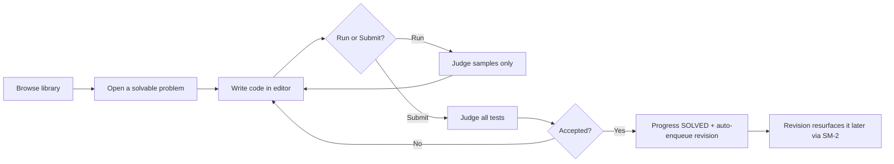

# Product Requirements Document

> This PRD describes NextHire **as it is implemented today**, plus a clearly separated view of what
> is planned or proposed. Each functional requirement is tagged:
> **[Implemented]**, **[Partial]**, **[Planned]**, or **[Proposed]**.
> "Planned" = evidence in code/schema of intent; "Proposed" = a reasonable future idea with no
> current implementation.

## 1. Overview

NextHire is a DSA (data structures & algorithms) interview-preparation platform. Its distinguishing
feature is a **real judge**: code a user writes is compiled and executed against hidden test cases
in an isolated sandbox, and the verdict reflects actual program behaviour (correctness, time,
memory) rather than a simulation. Around that core, NextHire provides a curated question library,
personal progress tracking, spaced-repetition revision, curated and custom study sheets, and timed
contests.

## 2. Goals & non-goals

### Goals
- Give candidates a trustworthy signal: a verdict means the code actually passed real tests.
- Make deliberate practice easy: track progress, resurface weak areas, and schedule revision.
- Support timed, competitive practice through contests with scoring and leaderboards.
- Keep the platform safe to operate: untrusted code cannot escape the sandbox or reach the network.
- Keep accounts secure: modern session handling resistant to XSS token theft and refresh replay.

### Non-goals (today)
- Not an online IDE for arbitrary projects — execution is scoped to judged problems.
- Not a general interview-scheduling / recruiter product (an earlier `INTERVIEWER` role and
  interview feature were removed; see [ROADMAP.md](ROADMAP.md)).
- Not a content marketplace — problems are curated/seeded, not user-published.

## 3. Personas

| Persona | Role | Needs |
|---|---|---|
| **Candidate** (primary) | `USER` | Practise problems, run/submit code, track progress, revise, join contests, keep private notes and study sheets. |
| **Administrator / Operator** | `ADMIN` | Author and maintain questions, run contests, manage users (disable, unlock, reset, revoke sessions), read analytics. |
| **Contest host** | `ADMIN` who created a contest | Configure a contest, create invite codes, run it to completion. (Hosting requires `contest:manage`, which is an admin capability.) |

## 4. User stories (selected)

- As a candidate, I can **run** my code against sample cases without it counting, then **submit**
  to be judged on all cases.
- As a candidate, I see my verdict update **live** (queued → running → result) without refreshing.
- As a candidate, I can filter the library by topic, difficulty, company, source, and frequency, and
  see which problems I've solved or bookmarked.
- As a candidate, I get problems **scheduled for revision** and can grade my recall to reschedule.
- As a candidate, I can keep **private notes** (approach, mistakes, complexity) per problem.
- As a candidate, I can join a **contest** by code, solve problems within the window, and see the
  leaderboard.
- As an admin, I can author a problem with statement, constraints, starter code, and sample+hidden
  tests, and verify it is solvable before it ships.
- As an admin, I can disable a compromised account and force it to sign out everywhere immediately.

## 5. Functional requirements

### Accounts & authentication (FR-A)
- **FR-A1 [Implemented]** Email+password registration with email verification; accounts are inert
  until verified when `EMAIL_VERIFICATION_REQUIRED`.
- **FR-A2 [Implemented]** Login issues a short-lived access token (in-memory on the client) and a
  rotating HttpOnly refresh cookie; "remember me" extends the refresh TTL.
- **FR-A3 [Implemented]** Refresh-token rotation with **reuse detection**: replaying an old token
  revokes the whole session family.
- **FR-A4 [Implemented]** Google sign-in (ID token + authorization-code flow) and GitHub sign-in
  (authorization-code flow), each linkable/unlinkable to an existing account.
- **FR-A5 [Implemented]** Password reset and change; both invalidate existing sessions via
  `tokenVersion`.
- **FR-A6 [Implemented]** Per-device session list; revoke a device or "log out everywhere".
- **FR-A7 [Implemented]** Per-account lockout after repeated failures; security-event timeline.
- **FR-A8 [Implemented]** Effective admin derived from `ADMIN_EMAILS` on every sign-in.

### Question library & browsing (FR-Q)
- **FR-Q1 [Implemented]** Browse/search questions with filters: topic, difficulty, company, source
  platform, interview frequency, and (signed-in) solved/bookmarked.
- **FR-Q2 [Implemented]** Two kinds of question: **solvable** (full statement + tests, judged here)
  and **reference-only** (metadata + external link, no local statement/tests).
- **FR-Q3 [Implemented]** Question detail shows statement, constraints, samples, hints, and (when
  present) editorial; **hidden test cases are never exposed to non-admins**.
- **FR-Q4 [Implemented]** Curated collections by company, topic, and source.

### Practice & code execution (FR-P)
- **FR-P1 [Implemented]** In-browser Monaco editor with per-language starter code.
- **FR-P2 [Implemented]** **Run** (samples only, no record) vs **Submit** (all tests, records
  progress/score).
- **FR-P3 [Implemented]** Real sandboxed execution in Python, C++, and Java; verdicts:
  ACCEPTED / WRONG_ANSWER / TLE / MLE / OLE / COMPILATION_ERROR / RUNTIME_ERROR / INTERNAL_ERROR.
- **FR-P4 [Implemented]** Live verdict updates over WebSocket with polling fallback.
- **FR-P5 [Implemented]** Submission history per user and per question (trial runs excluded).
- **FR-P6 [Partial]** Discussion tab exists on the solve page as a **placeholder**; threaded
  discussion is **[Planned]**.

### Progress, notes & dashboard (FR-G)
- **FR-G1 [Implemented]** Per-question progress (TODO/ATTEMPTED/SOLVED), attempts, accepted count,
  solve time, bookmark.
- **FR-G2 [Implemented]** Private structured notes per question (approach, mistakes, edge cases,
  time/space complexity, key insights, revision notes).
- **FR-G3 [Implemented]** Progress stats and an **activity streak + heatmap** endpoint.
- **FR-G4 [Implemented]** A dashboard composing the daily practice workflow.
- **FR-G5 [Implemented]** "Weak topics" surfacing based on progress.

### Revision / spaced repetition (FR-R)
- **FR-R1 [Implemented]** SM-2 scheduling: solved problems auto-enqueue; a review queue surfaces due
  cards.
- **FR-R2 [Implemented]** Grading a card reschedules it (interval + ease factor); cards can be
  enqueued/removed manually.

### Study sheets (FR-S)
- **FR-S1 [Implemented]** Curated **system** sheets (e.g. Blind 75, NeetCode 150, Grind 75, Striver
  SDE, Top Interview 150).
- **FR-S2 [Implemented]** User-authored **custom** sheets with add/remove/reorder items and sections;
  ownership enforced per record.

### Contests (FR-C)
- **FR-C1 [Implemented]** Contest lifecycle UPCOMING → LIVE → ENDED, advanced on a schedule and
  lazily on read.
- **FR-C2 [Implemented]** Join a contest directly or by invite code (invite codes are CSPRNG-based,
  with optional max-uses and expiry).
- **FR-C3 [Implemented]** In-contest submission is gated to the live window; score is awarded on the
  first ACCEPTED per problem; a liveness heartbeat is recorded.
- **FR-C4 [Implemented]** Leaderboard ranked by score (desc) then penalty (asc); a three-phase UX
  (lobby → arena → summary).
- **FR-C5 [Implemented]** Contest listings never leak problem statements to non-participants.

### Admin & operations (FR-D)
- **FR-D1 [Implemented]** Author/update/delete questions (with starter code, tests, hints, editorial).
- **FR-D2 [Implemented]** Create and host contests; create invite codes.
- **FR-D3 [Implemented]** User management: list/search, view login history, enable/disable, unlock,
  send reset, revoke sessions.
- **FR-D4 [Implemented]** Auth analytics.
- **FR-D5 [Implemented]** Rejudge a submission.

## 6. Non-functional requirements

- **Security** — untrusted code runs only in a locked-down sandbox (no network, read-only FS,
  dropped capabilities, resource caps); hidden test data never reaches solvers; tokens are not in
  browser storage; production refuses insecure config at boot. See
  [SYSTEM_DESIGN.md](SYSTEM_DESIGN.md#authentication--session-security).
- **Reliability** — verdicts survive transient failures (Redis persistence, boot reconcile, polling
  fallback); expiry/authorization are always enforced at read time.
- **Performance** — code execution is off the request path; hot queries are indexed; the editor is
  code-split and assets are cache-friendly.
- **Integrity** — uniqueness and cascade constraints enforce business rules; server-authoritative
  fields prevent client forgery of context/score/verdict.
- **Portability** — the whole stack runs via Docker Compose from a fresh checkout.

## 7. Key user flow

## 8. MVP scope (shipped)

The implemented feature set above constitutes a working product: verified auth, a real multi-language
judge, a browsable library with real + reference problems, practice with run/submit, progress and
notes, spaced-repetition revision, study sheets, and contests with scoring — deployable via Compose.

## 9. Acceptance criteria (representative)

- Submitting a known-correct solution yields ACCEPTED; a wrong one yields the specific failing
  verdict; an infinite loop yields TLE; excessive allocation yields MLE. (Covered by the judge tests
  and `verify:problems`.)
- A non-owner cannot read another user's submissions or a hidden test case's expected output.
  (Covered by exposure/authorization tests.)
- A refresh token replayed after rotation forces re-authentication. (Covered by auth-flow tests.)
- Contest submissions after the window are rejected and do not score.

## 10. Future requirements

- **[Planned]** Threaded discussion on problems (tab is a placeholder today).
- **[Planned]** Additional judged languages (the `Language` enum reserves JavaScript, TypeScript, Go;
  only Python/C++/Java execute today).
- **[Proposed]** Shared/global rate limiting for multi-replica API deployments.
- **[Proposed]** Editorial/solution video or richer analytics dashboards.

See [ROADMAP.md](ROADMAP.md) for status detail and evidence.
