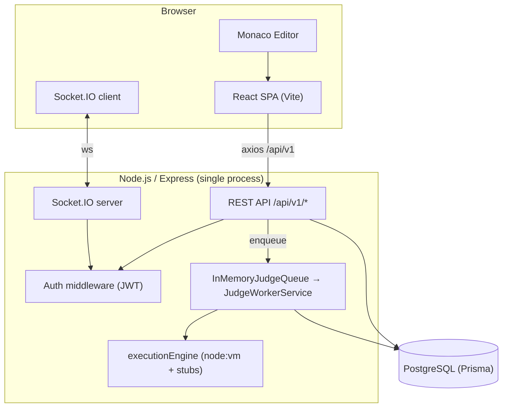
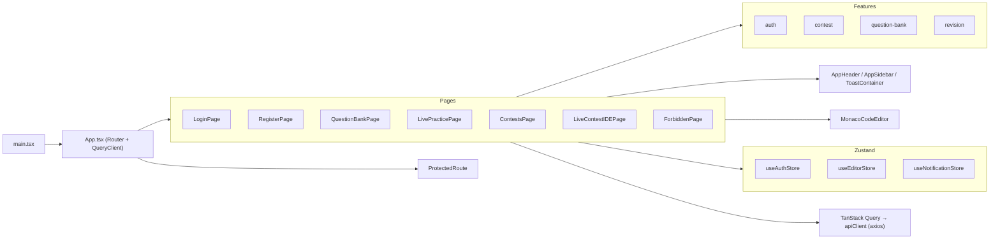
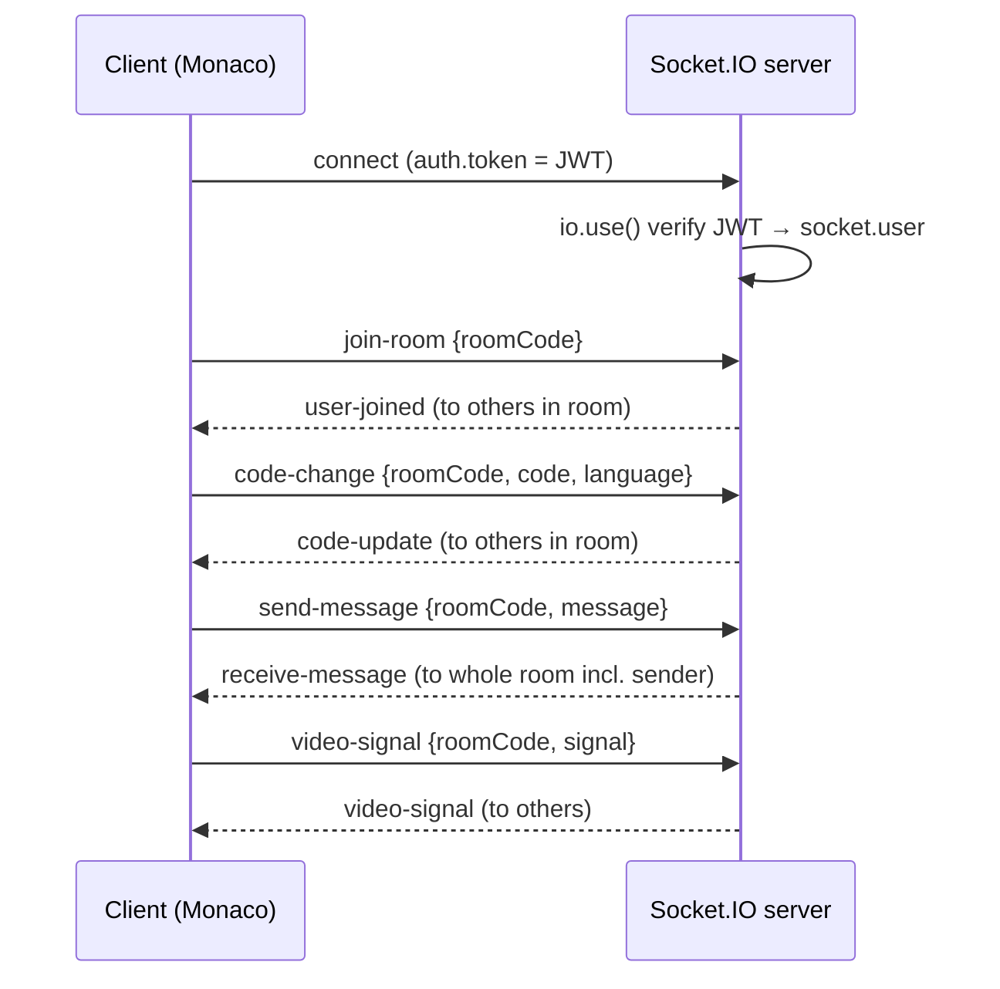
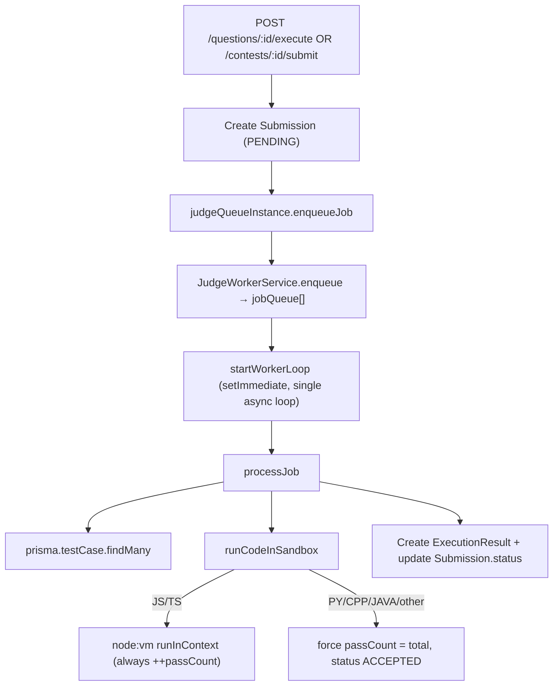
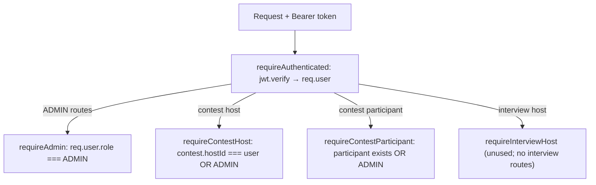
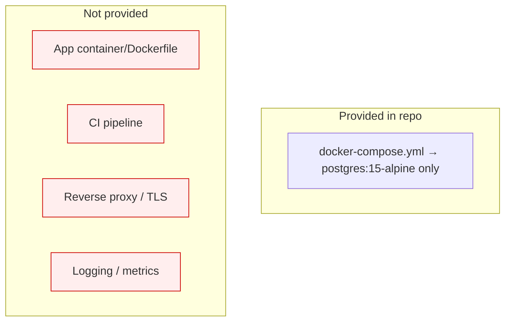

# NextHire — System Architecture

> Last reviewed: 2026-07-31. Describes the system as implemented.

## 1. Overall Architecture

NextHire is a two-tier SPA + REST monolith with an in-process async worker and a Socket.IO
real-time channel, backed by a single PostgreSQL database via Prisma.



**Key properties**
- Single Express process serves REST, static `/uploads`, docs, and Socket.IO.
- The "judge" is **in-process**, not an isolated microservice (contrary to ADR-0003's intent).
- No caching layer, no message broker, no CDN, no reverse proxy configured in-repo.

## 2. Frontend Architecture



- **Routing**: `react-router-dom` v6. Public: `/login`, `/register`, `/403`. Protected group:
  `/`, `/contests`, `/contest/:id`, `/questions`, `/questions/:id`. Catch-all → `/contests`.
- **Client state**: Zustand stores (auth token/user in `localStorage`; editor config; toasts).
- **Server state**: TanStack Query; axios instance injects `Bearer` token, redirects to
  `/login` on 401, and **unwraps `response.data`** in an interceptor (callers use `res.data`).
- **Code-splitting**: pages are `React.lazy`-loaded behind a Suspense spinner.
- **Design system**: Tailwind v4 with a large Material-style token palette in `tailwind.config.js`.

**Architectural notes / risks**
- The axios response interceptor returns `response.data`, so a `useQuery` returns the API body
  directly, but the query's TypeScript type is still `AxiosResponse` — a source of the
  `pagination` type error. See Tech Debt.
- Several layout links (`/profile`, `/notifications`, `/settings/editor`,
  `/admin/contests/create`) have **no route** and fall through to the catch-all.

## 3. Backend Architecture

Feature-sliced under `server/src/features/*` with shared infra under `server/src/shared/*`.

```
server/src
├── index.js                 # app bootstrap, CORS, routes, error handler, sockets
├── shared/
│   ├── db.js                # Prisma singleton
│   ├── docs/swagger.js      # tiny static OpenAPI stub (dev only)
│   └── storage/*.ts         # IStorageProvider + LocalStorageProvider (UNUSED, uncompiled)
├── socket/socketHandler.js  # Socket.IO auth + room events
└── features/
    ├── auth/                # controller, middleware (JWT), routes
    ├── question-bank/       # controller, routes
    ├── contest/             # controller, routes
    └── judge/               # InMemoryJudgeQueue, JudgeWorkerService, executionEngine, judgeWorker(dead)
```

- **Layering**: routes → controllers → Prisma. There is **no service/repository layer**;
  controllers embed business logic and data access directly.
- **Validation**: `zod` is a dependency but is **not used** anywhere; inputs are minimally checked.
- **Error handling**: each controller wraps in try/catch and returns `500 {error: err.message}`
  (leaks internal messages). A global Express error handler exists as a fallback.

## 4. Database Architecture

- PostgreSQL via Prisma; schema in `server/prisma/schema.prisma`.
- 3NF-normalized (per ADR-0004): join tables for tags/company-tags/contest-questions; separate
  `TestCase`, `StarterCode`, `Hint`, `Editorial`, `ExecutionResult`, `ProfileSkill`.
- Reserved-but-unused-at-runtime models: `Interview*`, `Notification`, `AIFeedback`,
  `AIHintRequest`, `AIInterviewerSession`, `RevisionSchedule`, `CompanyTag*`, `Tag*` (write path).

See `DATABASE_DESIGN.md` for the full model catalogue.

## 5. Socket Architecture



- Auth enforced in `io.use()`; unauthenticated handshakes are rejected.
- Rooms are arbitrary strings; the contest IDE uses `CONTEST-<id>`.
- **No server-side authorization** that a user belongs to the room they join (any authed user
  can join any room and receive its code/chat).
- Chat and WebRTC handlers exist but have no frontend consumer.

## 6. Judge Architecture



**Critical properties (defects):**
- `node:vm` is **not a security sandbox**; and the JS path increments `passCount` even when a
  test throws (comment: "Simulated pass"). Non-JS languages are pure stubs that always pass.
- Net effect: **almost every submission is `ACCEPTED`**, including syntactically invalid code
  (verified empirically).
- The queue is in-memory and process-local; jobs are lost on restart; no retries, no isolation,
  no timeouts beyond `vm`'s cooperative timeout (which does not stop CPU-bound native stubs).
- `judgeWorker.js` is a **dead duplicate** of the worker logic, imported nowhere.

## 7. Authentication Flow

```mermaid
sequenceDiagram
  participant U as User
  participant FE as SPA
  participant API as /auth
  participant DB
  U->>FE: enter email (or Google credential)
  FE->>API: POST /auth/login | /auth/google
  API->>API: determineRole(email) via hardcoded allowlist
  API->>DB: findUnique(email)
  alt not found
    API->>DB: create User (NO password check) + Profile
  end
  API->>API: jwt.sign({id,email,name,role}, secret, 7d)
  API-->>FE: {accessToken, user}
  FE->>FE: localStorage(token,user); set store
  FE->>API: GET /auth/me (Bearer) on load (checkAuth)
```

**Defects**: no password verification (auto-create), role by email string, dev fallback secret
if `JWT_SECRET` unset in non-production, Google `credential` is `jwt.decode`d **without signature
verification** (a forged Google token is trusted).

## 8. Authorization Flow



- Authorization is derived purely from the JWT payload (ADR-0002).
- **Gaps**: `GET /questions/:id`, `GET /questions`, `GET /contests`, `GET /contests/:id`,
  `GET /contests/:id/leaderboard`, `GET /questions/topics` are all **public** (no
  `requireAuthenticated`). `requireContestParticipant`/`requireInterviewHost` are defined but
  **not wired to any route**.

## 9. Storage Architecture

- `IStorageProvider` + `LocalStorageProvider` (TypeScript) define a file-upload abstraction
  writing to `./uploads` and serving via `/uploads` static middleware.
- **Not used**: no controller imports them; there is no upload route; and they are `.ts` files
  in an otherwise CommonJS/JS backend with **no TypeScript build step**, so they would not run
  as-is. Effectively dead/aspirational code (the S3-swap ambition is unrealized).

## 10. Deployment Architecture



- Only a Postgres service is containerized. There is **no Dockerfile for the app**, no CI, no
  process manager, no reverse proxy, and no environment separation beyond `NODE_ENV`.
- Dev: `client` on Vite `:3000` proxying `/api` and `/socket.io` to `:5000`; server on `:5000`.
- Note a **CORS/port mismatch**: server defaults `CLIENT_URL` to `:5173` in code and
  `.env.example`, but Vite runs on `:3000` (committed `.env` correctly uses `:3000`).
