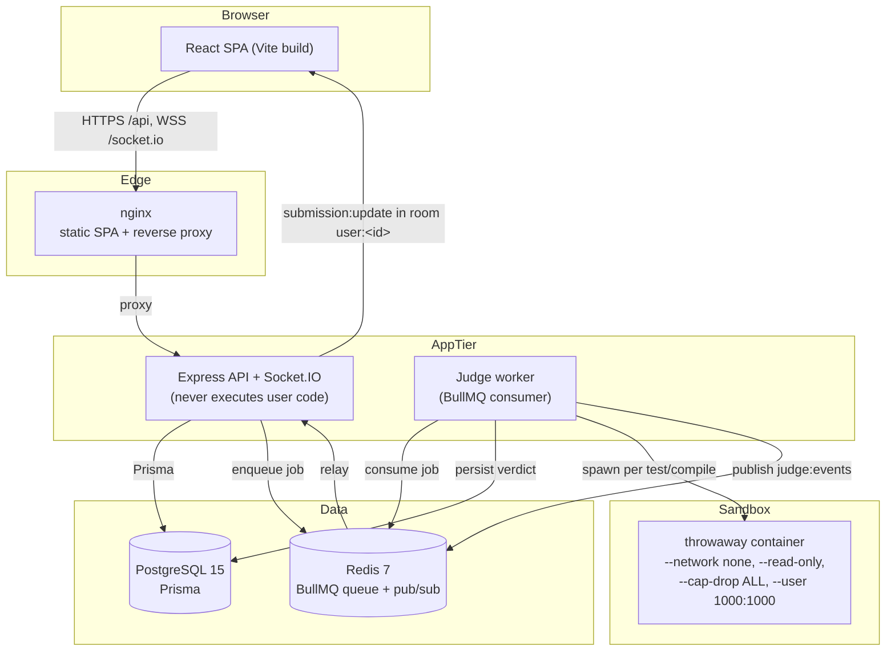
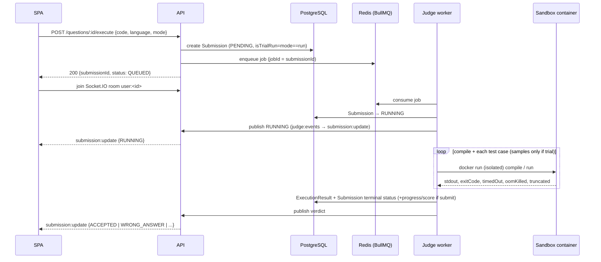
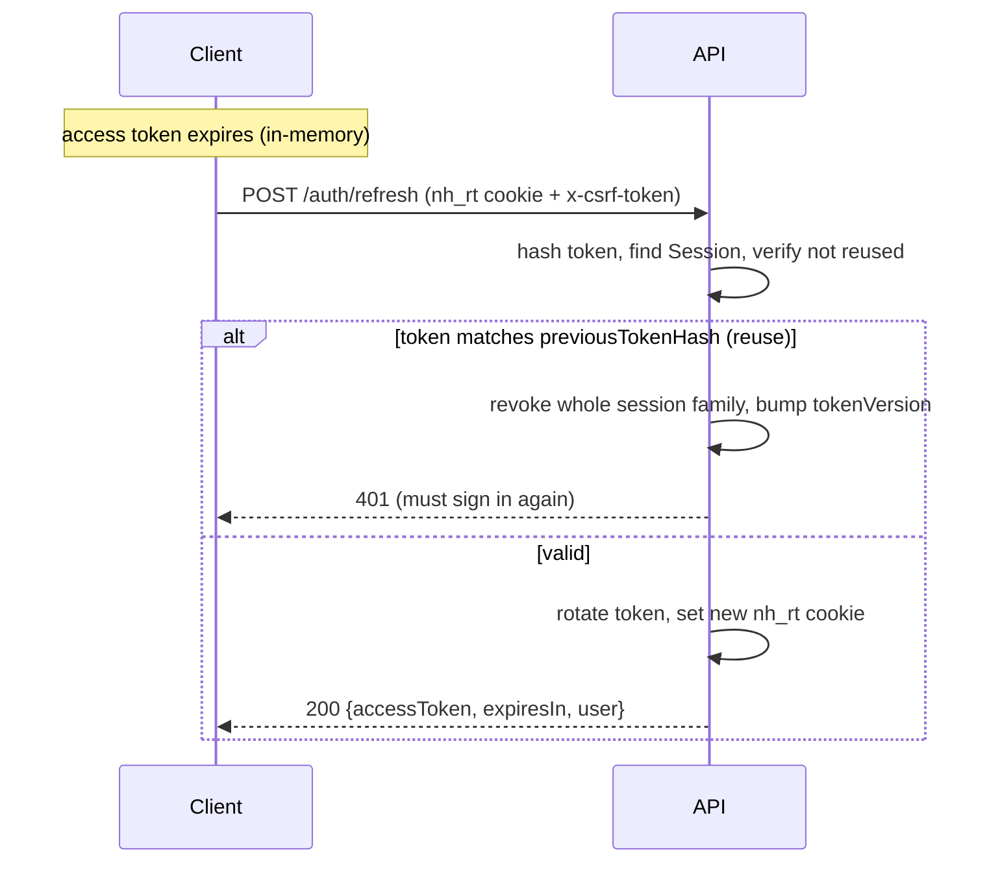

# System Design

> Verified against the source under [`server/src/`](../server/src/) and [`client/src/`](../client/src/),
> plus [`docker-compose.yml`](../docker-compose.yml) and the Dockerfiles.
> Where a design *rationale* could not be confirmed from code or docs, it is labelled **(inferred)**.

## Overview

NextHire is a DSA interview-prep platform whose defining property is that **submitted code is
really executed** against hidden test cases in a sandboxed, multi-language judge — verdicts come
from actual program behaviour, not simulation. The system is a single-page app talking to a JSON
REST + WebSocket API, backed by PostgreSQL and Redis, with code execution isolated in a separate
worker process that launches throwaway Docker containers.

## Architecture



### Runtime components

| Component | Tech | Responsibility |
|---|---|---|
| **Client SPA** | React 18 + TS 5, Vite 5, Tailwind v4, TanStack Query, Zustand, Monaco | UI, auth token handling (in-memory), live verdict rendering. |
| **API** | Node 20, Express 4 (CommonJS), Socket.IO | REST endpoints, auth/session, authorization, **enqueues** submissions — never runs user code. |
| **Judge worker** | Node 20, BullMQ | Consumes the queue, compiles/runs code in sandbox containers, computes verdicts, persists results, publishes events. Separate process; can be scaled independently. |
| **PostgreSQL 15** | Prisma 5 | System of record (27 models). |
| **Redis 7** | BullMQ + pub/sub | Job queue (`--appendonly` so queued jobs survive a restart) and the `judge:events` channel that relays verdicts back to the API. |
| **nginx** | nginx 1.27 | Serves the built SPA and reverse-proxies `/api` and `/socket.io` to the API, giving the browser a single origin (keeps the refresh cookie same-site). |

The API and worker are **the same image** run with different commands (`npm start` vs `npm run worker`) — one build, two roles.

## Data flow: a submission



If Redis or the socket is unavailable, delivery degrades gracefully: the worker still persists the
verdict, and the client polls `GET /questions/submission/:submissionId` until it reaches a terminal
status. On boot, `reconcilePendingSubmissions()` re-enqueues any submission left `PENDING` (e.g.
enqueued moments before a crash).

## The judge

The judge is the core of the product. Design details, all verified in
[`server/src/features/judge/`](../server/src/features/judge/):

### Isolation
Each compile step and each test-case run happens in its **own** throwaway Docker container, created
by the worker via the host Docker daemon. The container flags
([`executor/dockerExecutor.js`](../server/src/features/judge/executor/dockerExecutor.js)):

```
--network none            no network (no exfiltration / SSRF / DDoS)
--memory <cap> --memory-swap <cap>   hard memory cap, no swap  → OOM ⇒ MEMORY_LIMIT_EXCEEDED
--cpus <n>                CPU quota
--pids-limit 128          fork-bomb ceiling
--read-only               immutable root filesystem
--tmpfs /tmp:rw,exec,size=64m   small capped scratch, wiped on exit
--user 1000:1000          non-root
--cap-drop ALL            no Linux capabilities
--security-opt no-new-privileges   no setuid escalation
--ulimit fsize=33554432   32 MB write cap (disk-fill / output bombs)
--ulimit nofile=256       fd cap
```
Commands are passed as **argv arrays, never shell strings**, so user-controlled values are never
interpreted by a shell; the source is bind-mounted and a wall-clock timer kills a container that
overruns. **Untrusted code never runs in the worker container itself** — only in these sandboxes.

### Verdict logic
`determineVerdict` ([`executor/verdict.js`](../server/src/features/judge/executor/verdict.js)) is a
pure function, exhaustively unit-tested. Resource-limit signals are checked **before** correctness,
because a killed program has no trustworthy output. Priority:

1. `timedOut` → **TIME_LIMIT_EXCEEDED**
2. `oomKilled` → **MEMORY_LIMIT_EXCEEDED**
3. `outputTruncated` → **OUTPUT_LIMIT_EXCEEDED**
4. `exitCode !== 0` → **RUNTIME_ERROR**
5. output compare (whitespace/CRLF-normalised) → **ACCEPTED** or **WRONG_ANSWER**

A failed compile/syntax check short-circuits to **COMPILATION_ERROR** before any test runs; an
executor exception becomes **INTERNAL_ERROR**.

### Languages
Configured in [`executor/languageConfig.js`](../server/src/features/judge/executor/languageConfig.js);
only three are executable today (other `Language` enum values resolve to `null` → rejected):

| Language | Image (env-overridable) | Compile / check | Run |
|---|---|---|---|
| Python | `python:3.10-slim` | `python3 -m py_compile main.py` (syntax) | `python3 main.py` |
| C++ | `gcc:13` | `g++ -O2 -std=c++20 main.cpp -o main` | `./main` |
| Java | `eclipse-temurin:17-jdk` | `javac Main.java` | `java -cp . Main` |

### Run vs Submit
The same pipeline serves both, distinguished by `Submission.isTrialRun`:
- **Run** (`mode: "run"`) → judged on **sample** cases only; excluded from history; no progress,
  streak, acceptance-rate, or contest-score effects.
- **Submit** → judged on **all** cases; records progress and awards contest points on the first
  `ACCEPTED`. The trial flag is read from the **row**, not the request payload, so it cannot be
  spoofed after creation.

### Execution modes
- **Queue mode** (default, `JUDGE_INLINE=0`): API enqueues to BullMQ, a separate worker judges,
  verdicts return via Redis `judge:events` → Socket.IO. This is the production topology.
- **Inline mode** (`JUDGE_INLINE=1`): submissions are judged in-process with no Redis/worker — for
  local development. Events are emitted straight to Socket.IO.
- **Sandbox vs native**: `JUDGE_UNSAFE_LOCAL=1` swaps the Docker executor for a native one with
  **none** of the isolation — a developer convenience for machines without Docker, never for
  anything running untrusted input. See [local-judge notes] in the auth/ops config.

## Authentication & session security

Detailed in [ADR-0002](decisions/0002-in-memory-access-token-rotating-refresh.md); implemented in
[`server/src/features/auth/`](../server/src/features/auth/).

- **Access token** (JWT, ~15 min): claims `{ sub, email, role, tv, sid }`. The client keeps it in a
  **JavaScript variable, not `localStorage`**, so an XSS payload cannot read it from storage.
- **Refresh token**: opaque, delivered as an **HttpOnly** cookie (`nh_rt`); only its **sha256 hash**
  is stored (`Session.tokenHash`). Every refresh **rotates** the token and records the previous
  hash; re-presenting an old token is treated as theft and **revokes the entire session family**.
- **CSRF**: double-submit — a readable `nh_csrf` cookie must match the `x-csrf-token` header on
  `POST /auth/refresh` and `POST /auth/logout`.
- **Per-request revalidation**: authenticated requests re-check the DB — account active, `tv` equals
  the user's `tokenVersion`, session not revoked/expired. `tokenVersion` is bumped on logout-all,
  password change/reset, disable, and role change, immediately invalidating outstanding access
  tokens.
- **Boot-time safety**: `assertProductionConfig()` refuses to start production with a dev JWT secret,
  insecure cookies, or the console mailer — "better a crash than a quiet downgrade".
- **OAuth**: Google (ID-token verification + authorization-code flow) and GitHub
  (authorization-code flow only — GitHub is not OIDC, so the exchange and profile/email read happen
  server-side). Admin status is applied from `ADMIN_EMAILS`, never trusted from the provider.



## Authorization

Permission-based, not role-based at the call site. Routes declare a permission
(`requirePermission('question:manage')`); [`shared/authz.js`](../server/src/shared/authz.js) maps
roles → permissions. Adding a capability is a change to that one table. See
[ADR-0003](decisions/0003-permission-matrix-and-admin-emails.md).

## Real-time delivery

Socket.IO shares the HTTP CORS allow-list (a past bug fell back to a hard-coded localhost origin,
silently dropping live updates for correctly-configured deployments). Verdicts are emitted to the
room `user:<userId>` as `submission:update`. Polling is the fallback, so live updates are an
enhancement, not a dependency.

## Data layer

PostgreSQL via Prisma; schema and rationale in [DATABASE.md](DATABASE.md). Notable choices: separate
`ExecutionResult` from `Submission`; `testResults` as a JSON column with hidden-case I/O stripped at
the DTO boundary; server-authoritative `context`/`contestId`/`status`/`isTrialRun`.

## Tech choices & rationale

| Choice | Why (confirmed unless marked inferred) |
|---|---|
| **Docker-per-submission judge** | Only robust way to run untrusted code with hard resource caps and no network; documented extensively in the executor. |
| **Separate worker + BullMQ** | Keeps untrusted execution off the API event loop and lets judging scale horizontally (`--scale judge-worker=N`). See [ADR-0001](decisions/0001-sandboxed-judge-bullmq-worker.md). |
| **In-memory access token + rotating refresh cookie** | Defends against both XSS token theft (nothing in storage) and DB-leak replay (only hashes stored); reuse detection catches stolen refresh tokens. |
| **Permission matrix + `ADMIN_EMAILS`** | Admin is a deployment decision re-evaluated each login, not a mutable data value; new capabilities are one-line table edits. |
| **PostgreSQL + Prisma** | Relational data with strong constraints; Prisma gives typed access and tracked migrations. |
| **Prisma migrations over `db push`** | A deployment holding real submissions needs reviewable, roll-forward history. |
| **Feature-sliced modules** (client & server) | Each feature owns its routes/controllers/services (server) or pages/components/hooks (client). See [ADR-0004](decisions/0004-feature-sliced-architecture.md). |
| **Self-hosted Monaco, code-split** | (inferred) Avoids a CDN dependency and keeps the editor out of the initial bundle. |
| **Hand-rolled security headers over helmet** | Deliberate: a JSON API + static SPA needs only a handful of headers; comment in `index.js` states this. |

## Error handling

- A global Express error handler returns the envelope `{ success, error, code }`; production hides
  internal messages (which can carry table names / query fragments) behind a generic string.
- Unmatched `/api` paths return a `404 NOT_FOUND` rather than falling through to a confusing 500.
- The judge maps every failure mode to a specific `SubmissionStatus`; executor exceptions become
  `INTERNAL_ERROR` and the submission still reaches a terminal state.

## Performance

- **Judging is off the request path** — the API returns immediately with a submission id; work
  happens in the worker. `JUDGE_CONCURRENCY` (default 4) bounds parallel sandboxes per worker.
- **Indexes** back the hot queries (submissions by user/question/contest, progress by user/status,
  auth events by user/email/type). See [DATABASE.md](DATABASE.md#data-integrity).
- **Client** code-splits Monaco and uses TanStack Query caching; static assets are served by nginx
  with `1y immutable` caching, `index.html` `no-store`.
- **Live updates** avoid polling storms via Socket.IO, with polling only as a fallback.

## Scalability

- **Judge workers scale horizontally** — stateless consumers of a shared BullMQ queue.
- **API** is stateless (session state is in Postgres, not memory) and can run multiple replicas
  behind the proxy. *Caveat:* the rate limiter is **in-memory per process**, so limits are per
  instance rather than global until moved to a shared store — a known limitation for multi-replica
  API deployments (see [ROADMAP.md](ROADMAP.md)).
- **Redis** persists the queue (`--appendonly`) so a restart doesn't silently drop queued jobs.

## Deployment

`docker-compose.yml` brings up five services — `postgres`, `redis`, `api`, `judge-worker`,
`client` — with two named volumes (`pgdata`, `redisdata`). Configuration comes from a `.env` file;
every value has a dev default, and required secrets (`JWT_SECRET`, `ADMIN_EMAILS`, `MAIL_PROVIDER`)
are enforced with `${VAR:?}`.

- **API image** (`server/Dockerfile`, `node:20-bookworm-slim`) installs the Docker CLI, runs
  `npm ci --omit=dev` + `npx prisma generate`, and serves the API. The same image runs the worker.
- **Client image** (`client/Dockerfile`) builds the SPA (Vite inlines `VITE_*` at **build** time via
  build args) and serves it from nginx, which reverse-proxies `/api` (120s read timeout) and
  `/socket.io` (3600s, WebSocket upgrade) to the API.
- **Sandbox images** must be pulled onto the judge host before first run
  (`python:3.10-slim`, `gcc:13`, `eclipse-temurin:17-jdk`); a missing image surfaces as
  `INTERNAL_ERROR`. Optional purpose-built images in `server/docker/` add a uid-1000 user (matters
  mainly for Java under `--user 1000:1000`).

### Security posture of the worker
The worker mounts `/var/run/docker.sock`, which is **root-equivalent on the host** — this is how it
creates sandbox containers. Run it on a host dedicated to judging (or point it at a rootless/remote
Docker endpoint); never co-locate it with anything sensitive.

### Migrations caveat
The compose `api` command is `npm start`; it does **not** run migrations automatically. Apply them
out-of-band with `npm run prisma:migrate` (`prisma migrate deploy`) as part of the deploy. The root
README's phrasing ("the API image runs `prisma migrate deploy`") overstates this — the image does
not; you run it. See [DATABASE.md](DATABASE.md#migrations).

## Key tradeoffs

- **Two processes (API + worker) and two datastores** add operational surface, bought for isolation
  and independent scaling of judging.
- **Docker socket mount** is powerful and dangerous; mitigated by host isolation, not eliminated.
- **In-memory rate limiting** is simple and dependency-free but not shared across API replicas.
- **JSON `testResults`** trades SQL queryability for a natural write-once/read-whole shape.
- **Access token in memory** means a full page reload requires a silent refresh to restore the
  session — accepted for the XSS-resistance it buys.
